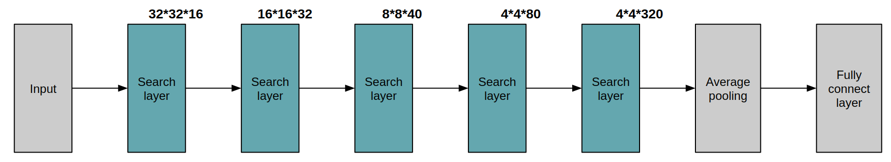
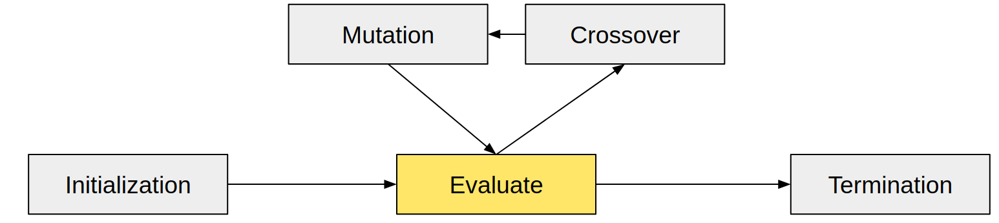
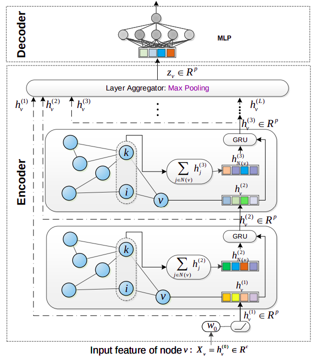
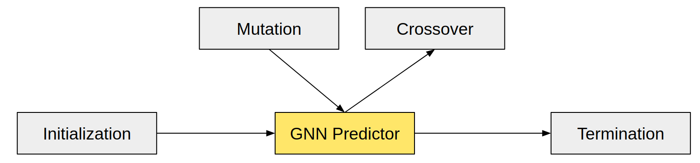
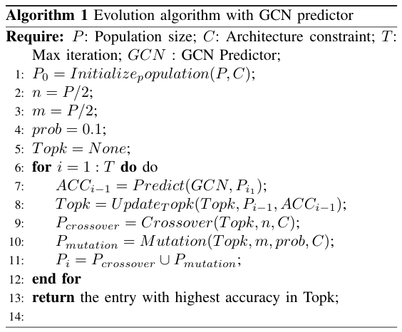
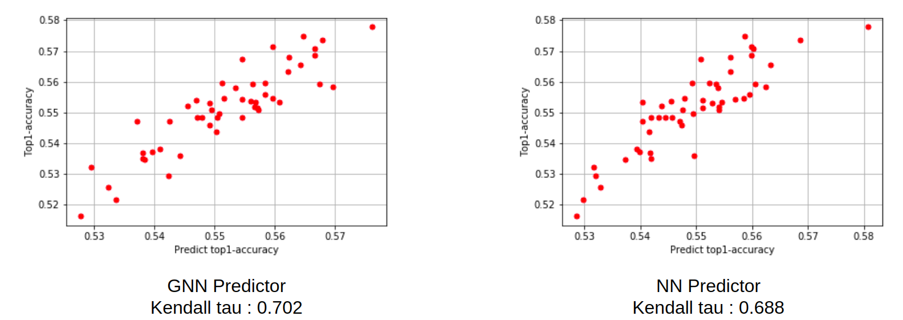
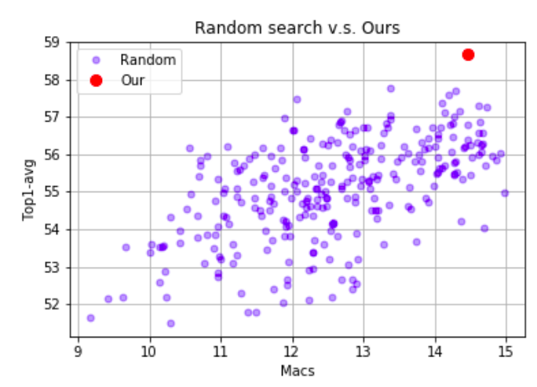
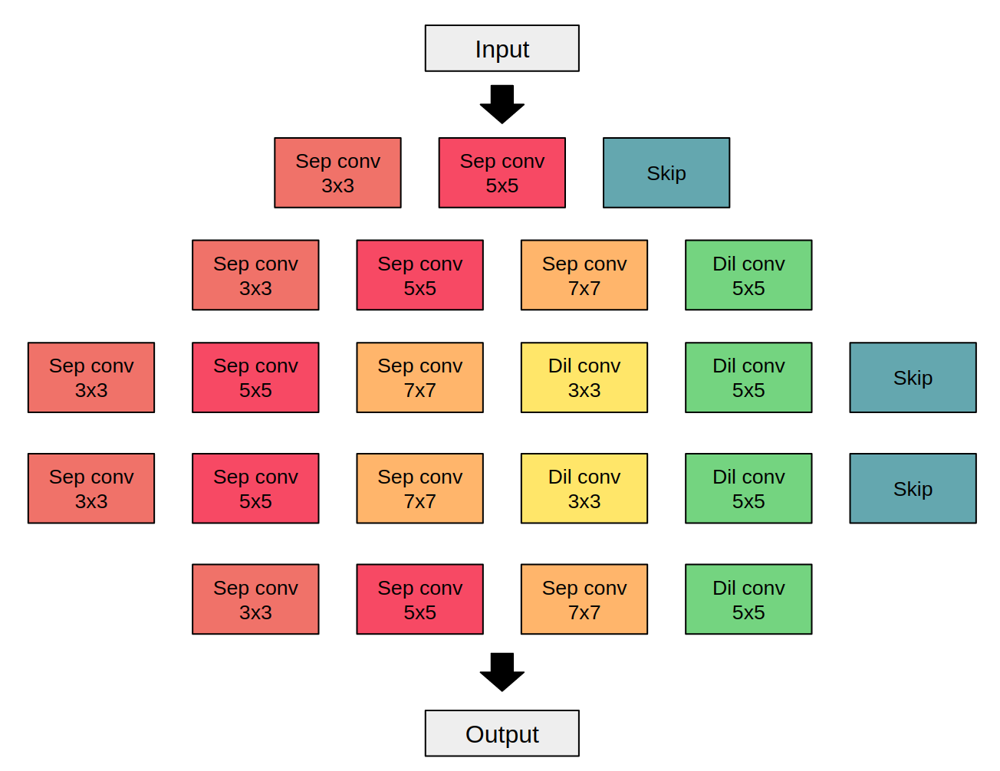

# Neural Architecture Search with GNN Predictor
## Introduction
Deep neural networks have brought surprising advances in various application fields. However, it is difficult to directly deploy deep neural network on the hardware with limited resources(e.g., low memory or low computation power).
Neural architecture search (NAS) is thus important and urgently-demanded to automate model design **for different hardware constraint**. 

In this project, our NAS method utilized evolution algorithm and GNN predictor to search the best architecutre in the search space.

## Search Space
Before searching, we fixed the macro architecture in our search space(e.g., the total layers, feature map size in each layers and channel size in each layers).
The macro architecture:



The only component we are going to search is the operation in each layer.
* The candidate operations:
    * Separate convolution 3x3
    * Separate convolution 5x5
    * Separate convolution 7x7
    * Dilated convolution 3x3
    * Dilated convolution 5x5
    * Skip

In each layer, each candidate operation can be selected or not. In total, our search space has a size of  .
## Method
After defining search space, we can totally utilize evolution algorithm to search the architecture:



In each evaluating step, we have to train each population architecture to get the parent architectures.
However, it takes a lot of time to train each population architecture in each evolution step. And we cannot reuse the training result of the population architecture between each evolution algorithm process.
To save time, we train a GNN predictor to predict the validation accuracy of each population architecture instead of train a few epochs. With the GNN predictor, we can finish the evolution algorithm to get the architecture in seconds.

### GNN Predictor
The architecture of our GNN predictor is followed [1].<br>

In order to train the GNN predictor, we random sampled 300 architecture from our search space and trained each architecture for 60 epoch to get the gound truth validation accuracy.
And we split 300 architectures to training dataset and testing dataset(250 v.s 50).

With GNN Predicot, we can model our evolution algorithm:



The algorithm in this project:<br>


## Experiment
### Experiment Setting
In the project, we perform all experiments based on the CIFAR100 dataset.
#### Predictor Training
For training predictor, we random sampled 300 architectures from our search space and trained each architecture for 60 epochs to get the gound truth validation accuracy.
We spent 2 day to train 300 architecture on 4 1080Ti.
#### Evaluate
* Kentall tau[2]:
    * Measure the correlation between predict accuracy and ground truth accuracy.
* MACs
    * Multiply-accumulate operation
* Top1 accuracy
### GNN Predictor
In order to verify the performnace of GNN predictor, we trained a NN Predictor and calculate the Kentall tau to show the correlation between the ground truth accuracy and predict accuracy.


### CIFAR100 Results
In this experiment, we search the best architecture by our method and compared with the result of random search.
Under the almost hardware resourece limitations, our method obtain a highly competitive result 58.67% top-1 accuracy for CIFAR100 classification, which surpasses random search (+0.9%)


And we also visulize the result for 300 architectures and our architecture(For fair comparison, we train each architecture with the same training strategy).



In the figure, we found that the architecture searched by our method is better than all architectures random sampled from search space.
## Discussion
### Final Searched Architecture
The final searched architecture:<br>

## Instruction
we provide the training data (the validation accuracy and architecture of 300 architecture sampled from the search space), the searched architecture and the weight of the GNN predictor in `./logs/`.

1. Modify the training setting in `config/config.yml`
2. Install dependency ``pip3 install -r requirements.txt``

#### Random sample architecture
```
python3 evaluate.py --cfg config/config.yml --generate-architecture
```

#### Train random sample architecture
```
python3 train.py --cfg config/config.yml --train-data --load-architecture
```
#### Train predictor
```
python3 train_predictor.py --cfg config/config.yml 
```

#### Evoluate architecture
```
python3 evolution.py --cfg config/config.yml
```

#### Train searched architecture
1. Modify the path of `path_to_architecture` to the evolution architecture in `config/config.yml`
```
python3 train.py --cfg config/config.yml --load-architecture
```

## Reference
[1] Changjun Fan, Li Zeng, Yuhui Ding, Muhao Chen, Yizhou Sun, Zhong Liu. Learning to Identify High Betweenness Centrality Nodes from Scratch: A Novel Graph Neural Network Approach 
[2] KENDALL, M.G.: A NEW MEASURE OF RANK CORRELATION. Biometrika 30(1-2), 81–93 (06 1938). https://doi.org/10.1093/biomet/30.1-2.81, https:// doi.org/10.1093/biomet/30.1-2.81


